# SƠ ĐỒ CẤU TRÚC & LUỒNG XỬ LÝ CHỨC NĂNG HỆ THỐNG
**Dự án: Hệ thống Quản lý Nhà hàng (Restaurant Management System)**

---

## 1. TỔNG QUAN LUỒNG HOẠT ĐỘNG HỆ THỐNG (HIGH-LEVEL SYSTEM FLOW)

Sơ đồ thể hiện sự tương tác giữa Khách hàng, Giao diện Client (React), Máy chủ API (Express.js), Cơ sở dữ liệu (MySQL), Cổng thanh toán (SePay) và Dịch vụ Email (Nodemailer).

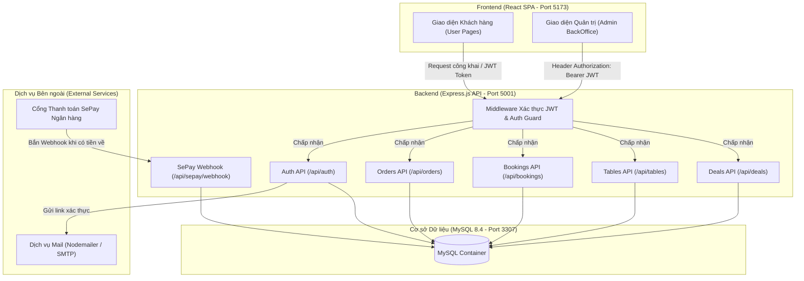

---

## 2. LUỒNG XÁC THỰC & KÍCH HOẠT TÀI KHOẢN (AUTHENTICATION FLOW)

### 2.1. Đăng ký & Kích hoạt Email
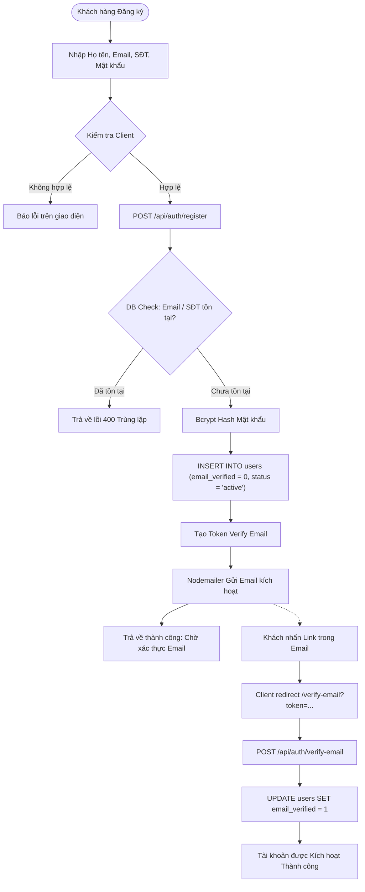

### 2.2. Đăng nhập & Duy trì Phiên làm việc JWT
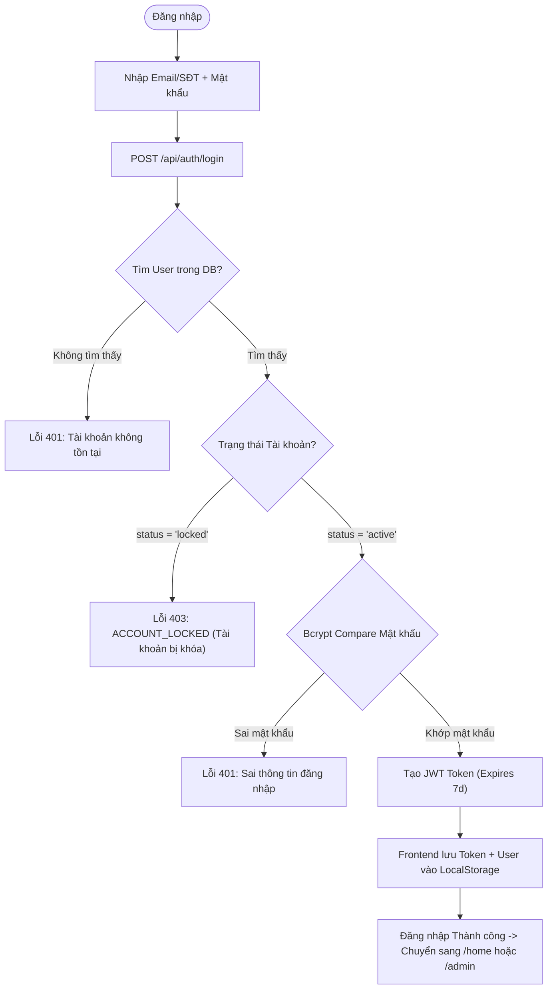

---

## 3. LUỒNG ĐẶT MÓN TRỰC TUYẾN & THANH TOÁN TỰ ĐỘNG SEPAY QR (ONLINE ORDER & SEPAY)

Sequence Diagram thể hiện chi tiết luồng thanh toán đơn hàng online, ghi nhận thanh toán từng phần qua bảng `order_payments` và kích hoạt Socket.io.

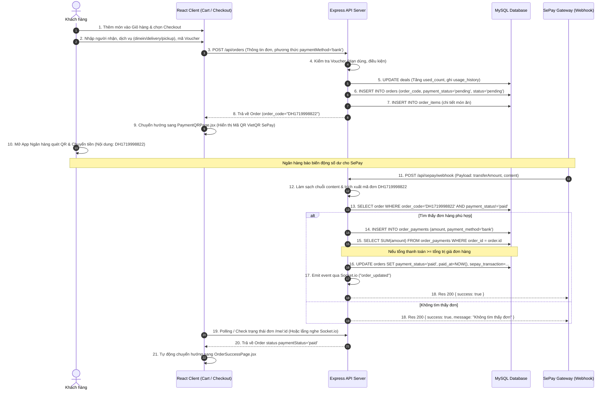

---

## 4. LUỒNG ĐẶT BÀN TRỰC TUYẾN & KIỂM TRA BÀN TRỐNG (TABLE RESERVATION)

Sơ đồ thể hiện thuật toán kiểm tra sức chứa bàn (`validateTableCapacity`) và chống trùng lịch đặt (`hasTableConflict`).

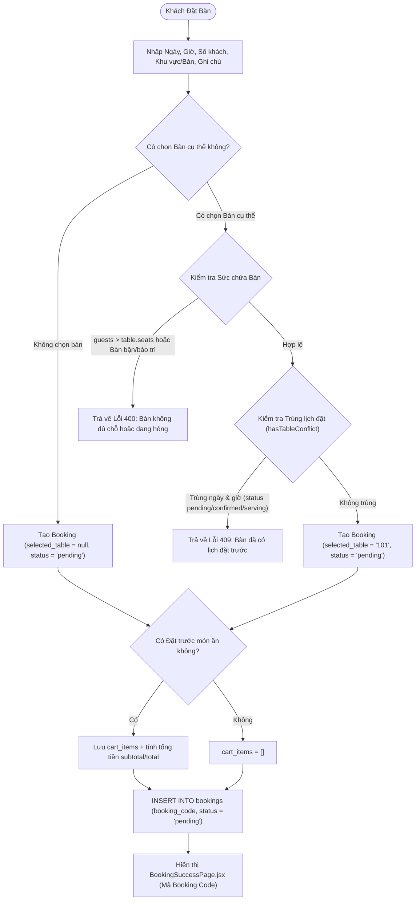

---

## 5. LUỒNG BẢO VỆ & ĐIỀU HƯỚNG ADMIN (ADMIN AUTH GUARD)

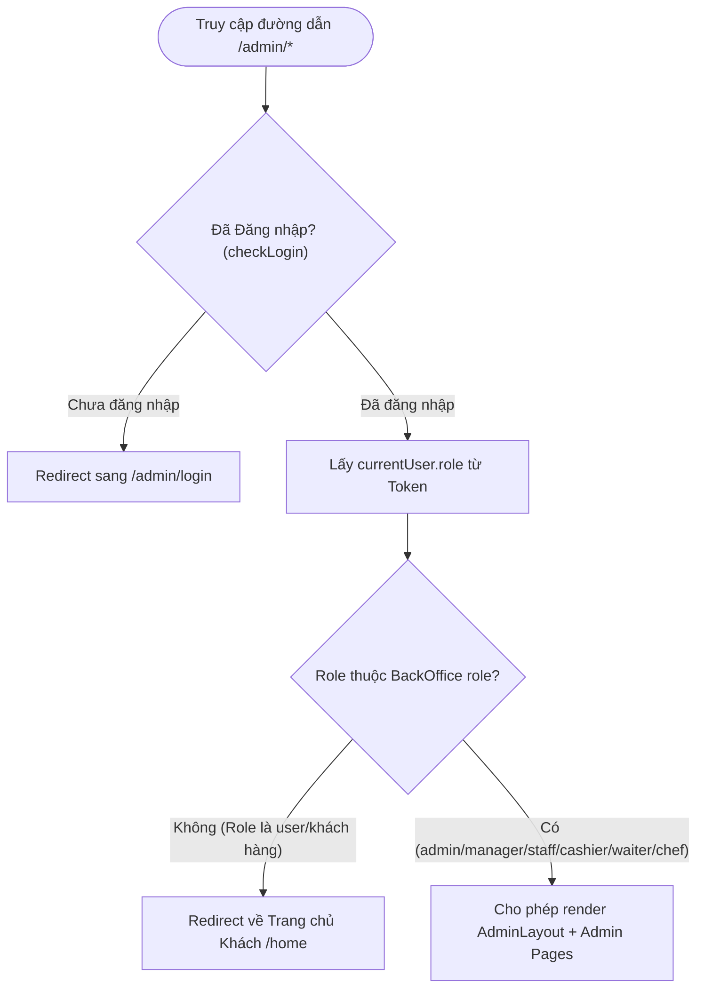

---

## 6. LUỒNG QUẢN LÝ VÒNG ĐỜI ĐƠN HÀNG TRONG ADMIN (ORDER LIFECYCLE STATE DIAGRAM)

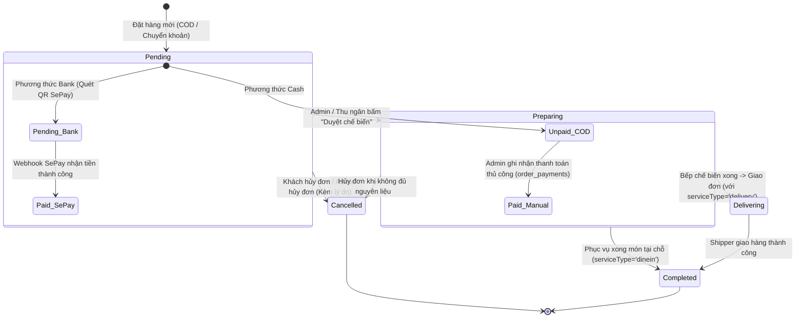

---

## 7. LUỒNG DUYỆT ĐẶT BÀN & XẾP BÀN TRONG ADMIN (ADMIN BOOKING & SEAT ASSIGNMENT)

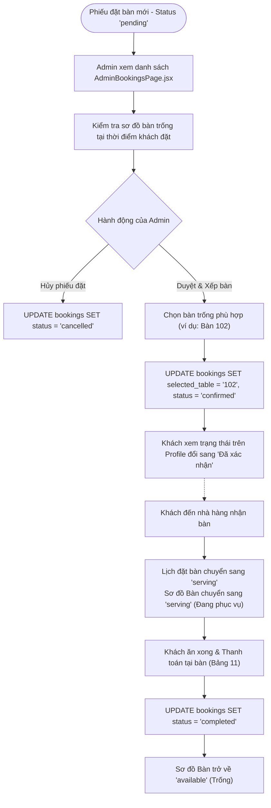

---

## 8. LUỒNG QUẢN LÝ BÀN & TỰ ĐỘNG SINH MÃ BÀN (TABLE & SMART CODE GENERATION)

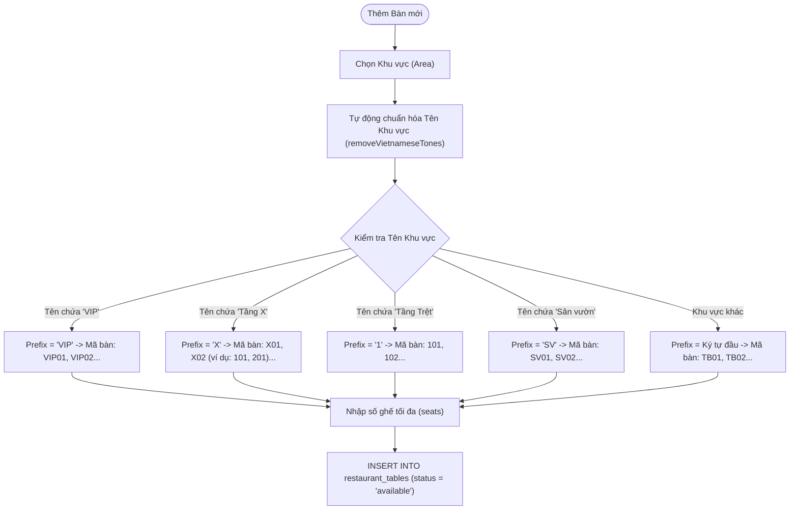

---

## 9. LUỒNG KIỂM TRA & TIÊU DÙNG MÃ GIẢM GIÁ / VOUCHER (DEALS / VOUCHER FLOW)

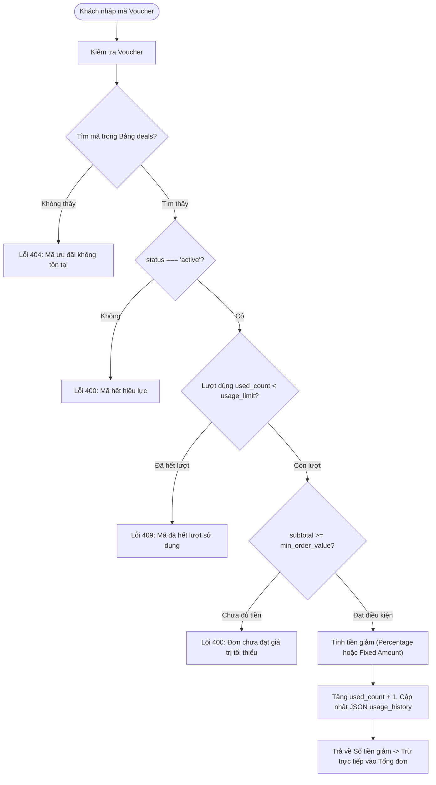

---

## 10. LUỒNG PHÂN NHÓM KHÁCH HÀNG TỰ ĐỘNG & NHẬT KÝ HOẠT ĐỘNG (USER GROUPING & LOGGING)

### 10.1. Thuật toán Phân nhóm Khách hàng (`getUserGroup`)
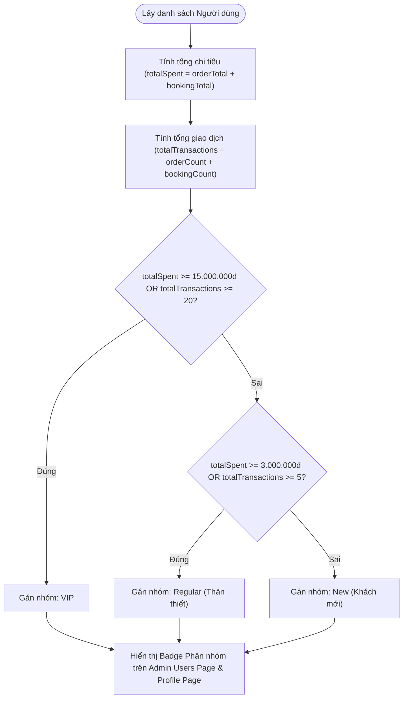

### 10.2. Ghi nhật ký Hoạt động Quản trị (`user_activity_logs`)
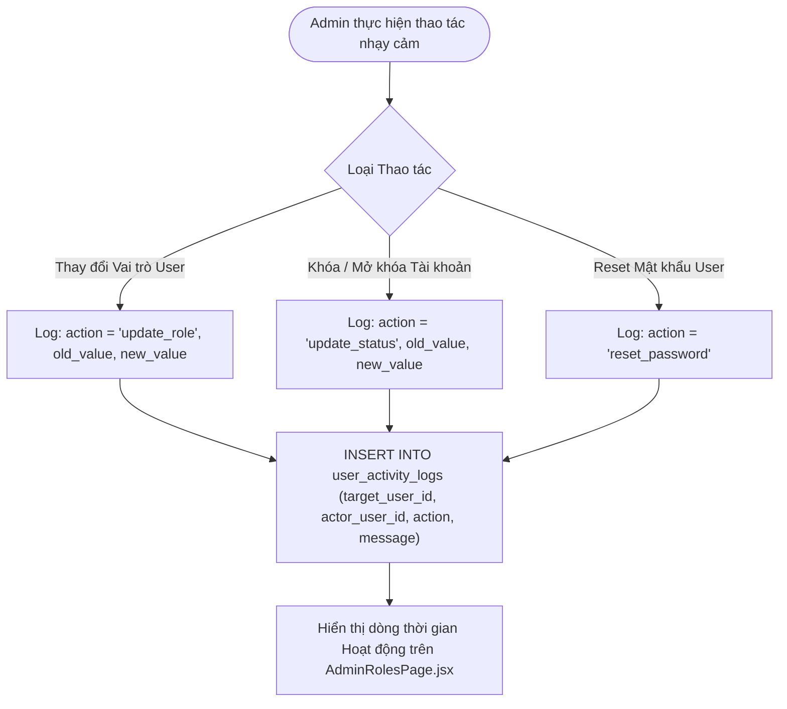

---

## 11. LUỒNG THANH TOÁN TẠI BÀN (TABLE BILLING & CHECKOUT)

Quy trình quản lý hóa đơn, gọi thêm món, áp coupon và xử lý đối soát SePay tự động cho khách ăn tại chỗ:

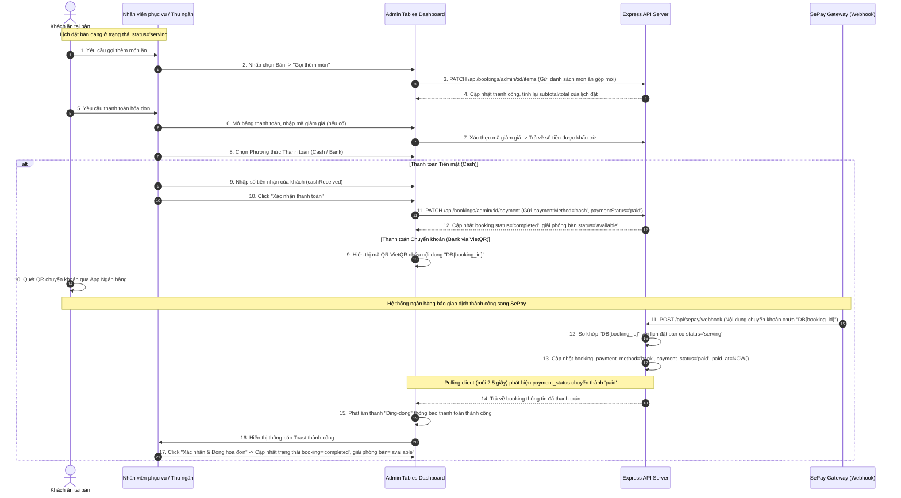

---

## 12. LUỒNG TỰ ĐỘNG RESET BÀN HẰNG NGÀY (DAILY AUTO-RESET STALE TABLES)

Sơ đồ hoạt động của dịch vụ nền dọn dẹp các lịch đặt bàn/bàn ăn bị quên hoặc quá hạn sang ngày mới.

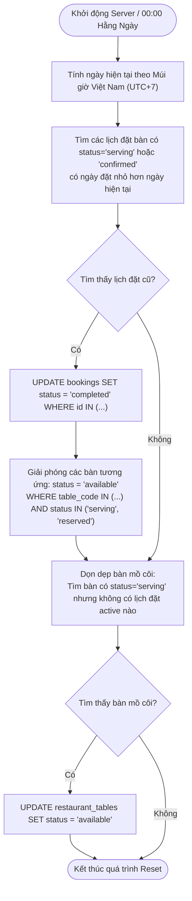
