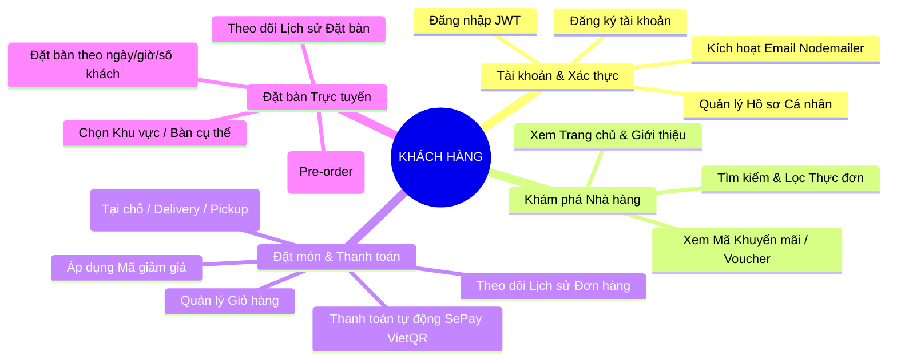
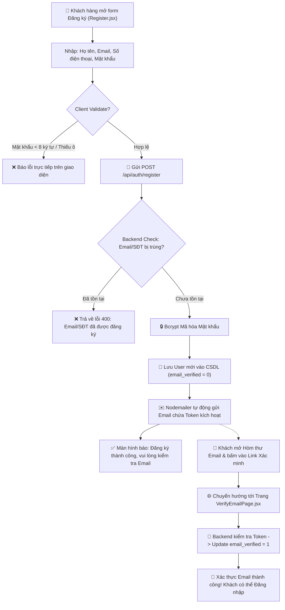
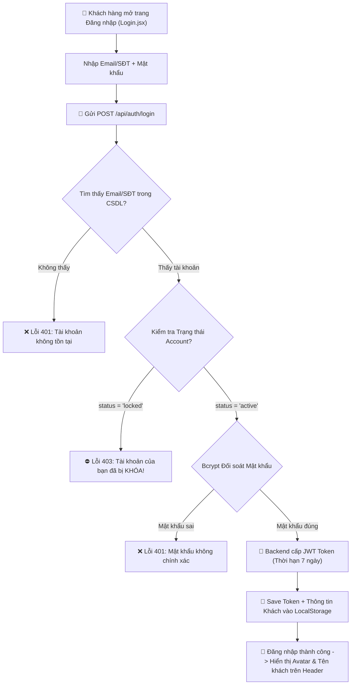
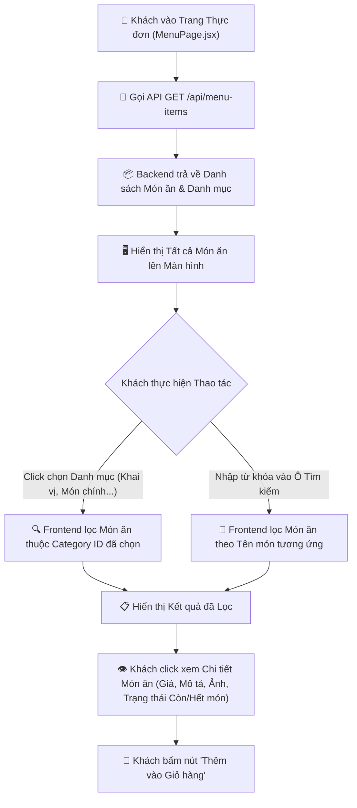
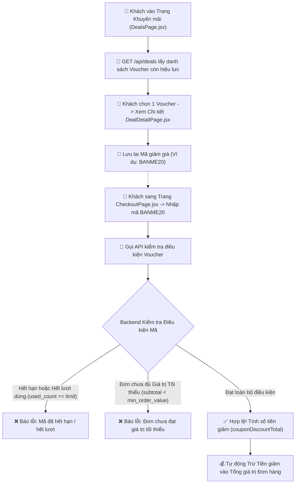
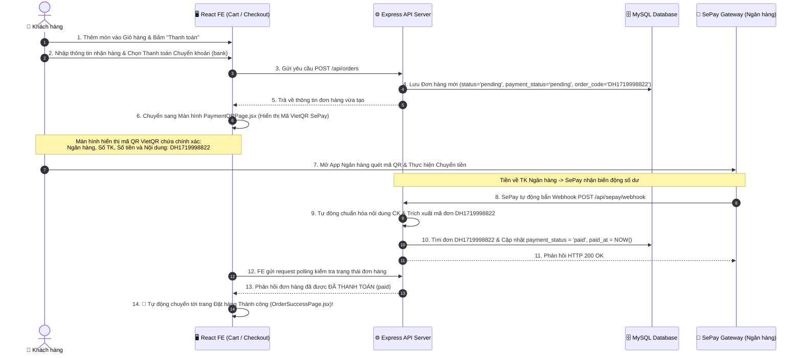
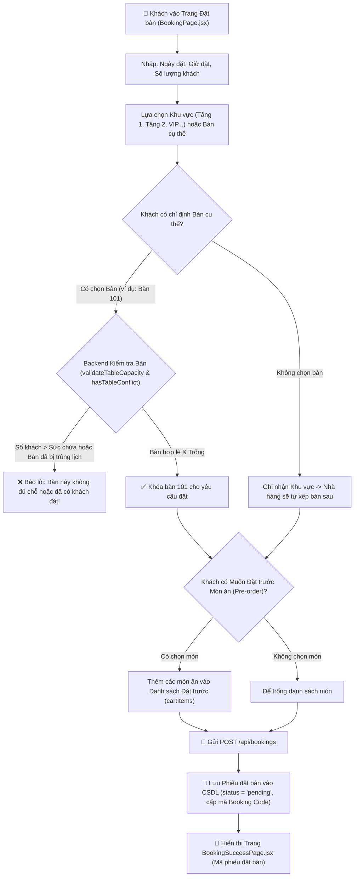
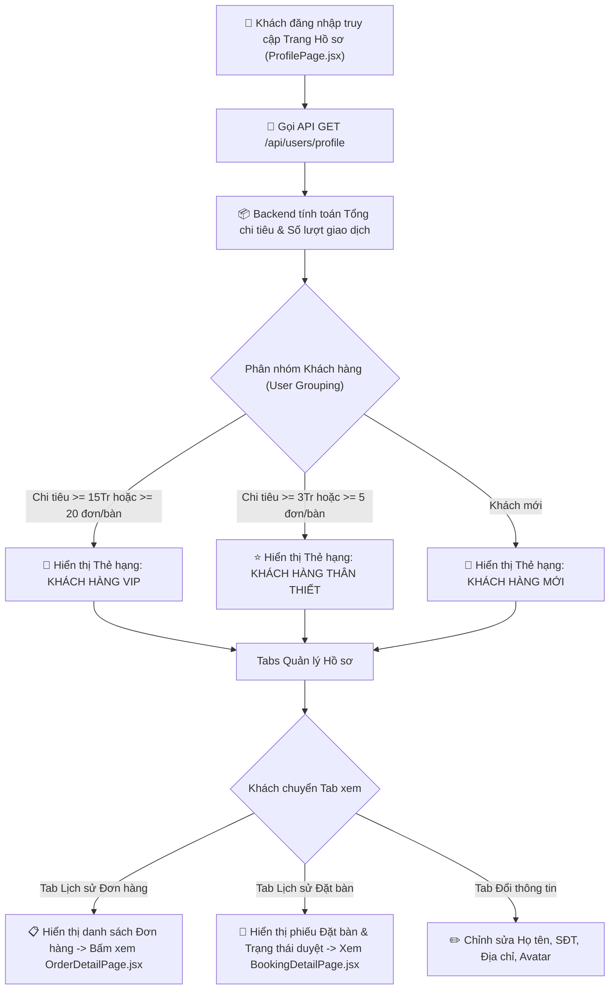

# SƠ ĐỒ LUỒNG HOẠT ĐỘNG CÁC CHỨC NĂNG DÀNH CHO KHÁCH HÀNG
**Hệ thống Quản lý Nhà hàng (Customer Features Workflow Diagrams)**

---

## 1. TỔNG QUAN CÁC CHỨC NĂNG CỦA KHÁCH HÀNG (CUSTOMER MAP)

---

## 2. CHI TIẾT SƠ ĐỒ TỪNG LUỒNG CHỨC NĂNG KHÁCH HÀNG

### 🔑 Chức năng 1: Đăng ký Tài khoản & Xác thực Email
Dưới đây là sơ đồ luồng từng bước từ khi khách điền thông tin đăng ký cho tới khi nhận email kích hoạt.

---

### 🔓 Chức năng 2: Đăng nhập & Duy trì Phiên làm việc (Session)
Luồng xử lý khi khách đăng nhập và cơ chế lưu trữ JWT Token để duy trì trạng thái đăng nhập trên ứng dụng.

---

### 🍕 Chức năng 3: Tìm kiếm & Khám phá Thực đơn (Menu Search & Filter)
Luồng hỗ trợ khách hàng tìm kiếm món ăn theo tên và lọc theo từng danh mục món.

---

### 💳 Chức năng 4: Xem Khuyến mãi & Áp dụng Mã giảm giá (Deals & Vouchers)
Luồng khách hàng khám phá mã ưu đãi và áp dụng khi thanh toán đơn hàng.

---

### 🛒 Chức năng 5: Đặt món Trực tuyến & Thanh toán Tự động SePay VietQR
Đây là **luồng quan trọng nhất** tích hợp Cổng thanh toán SePay tự động khớp giao dịch chuyển khoản ngân hàng qua Webhook real-time.

---

### 📅 Chức năng 6: Đặt bàn Trực tuyến & Đặt trước Món ăn (Table Reservation)
Luồng khách hàng chủ động chọn ngày, giờ, số khách, chọn khu vực/bàn ăn và chọn trước món ăn cho buổi tiệc.

---

### 👤 Chức năng 7: Quản lý Hồ sơ Cá nhân & Lịch sử Đơn / Đặt bàn
Luồng khách hàng theo dõi phân hạng tài khoản và lịch sử giao dịch.

---

## 3. TỔNG KẾT TÍNH NĂNG NỔI BẬT DÀNH CHO KHÁCH HÀNG

| STT | Chức năng Khách hàng | Điểm nổi bật trong xử lý hệ thống |
| :---: | :--- | :--- |
| **1** | Đăng ký & Kích hoạt Email | Tự động gửi Email qua Nodemailer, mã hóa bảo mật Bcrypt. |
| **2** | Đăng nhập & Lưu Session | Bảo mật qua JWT Token 7 ngày, kiểm tra chặn tài khoản locked. |
| **3** | Tìm kiếm & Lọc Thực đơn | Lọc đa tiêu chí theo danh mục và từ khóa thời gian thực. |
| **4** | Áp dụng Voucher Khuyến mãi | Tự động đối soát điều kiện hạn dùng, số lượt dùng và tổng đơn tối thiểu. |
| **5** | Đặt món & Thanh toán VietQR SePay | **Thanh toán tự động 100% qua Webhook SePay**, đối soát mã đơn và cập nhật trạng thái tức thì mà không cần duyệt tay. |
| **6** | Đặt bàn & Đặt trước Món | Kiểm tra tự động sức chứa bàn & chống đặt trùng lịch bàn. |
| **7** | Quản lý Hồ sơ & Lịch sử | Tự động xếp hạng VIP/Regular dựa trên lịch sử tích lũy chi tiêu. |
